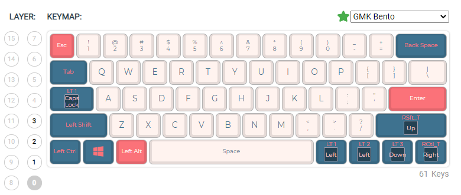
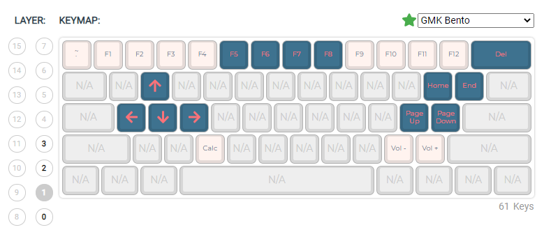
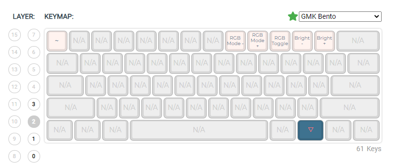
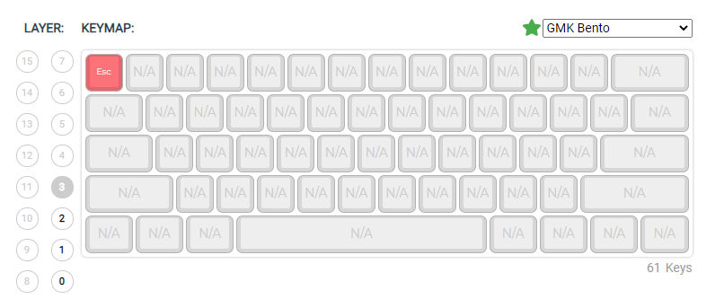

# DZ60_KEYMAP (Inspired by Anne pro 2)

1. Import **My_Keymap.json** file to https://config.qmk.fm/. 
2. Compile it.
3. Download fireware, you'll get a hex file.
4. Open qmk_toolbox.exe and load the hex file.
5. Reset your PCB and hit the flash button.
6. ENJOY!

